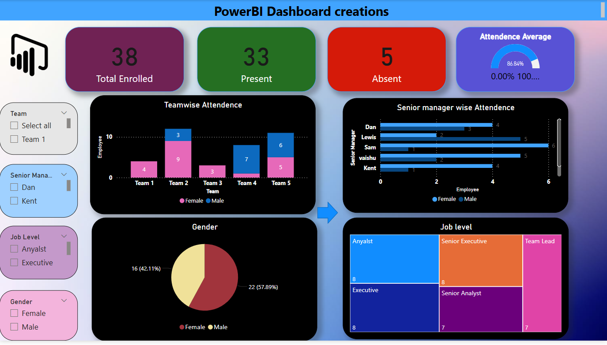

# 📊 Power BI Dashboard – Team Attendance Analysis

This project is a **Power BI Dashboard** that provides insights into employee attendance, enrollment, and demographics.  

---

## 📌 Features
- **Total Enrolled vs Present** overview  
- **Team-wise Attendance** (with gender breakdown)  
- **Filters** by Team, Senior Manager, Job Level, and Gender  
- **Gender Distribution** with percentage split  
- **Interactive dashboard** for quick insights  

---

## 🖼️ Dashboard Preview

---

## 📂 Project Structure

powerbi-dashboard/
│── dashboard.pbix # Power BI file
│── screenshots/ # Folder with screenshots
│ └── Screenshot 2025-08-12 112400.png
│── README.md # Project documentation

---

## 🚀 How to Use
1. Open the `dashboard.pbix` file in **Power BI Desktop**.  
2. Explore visuals and apply filters for deeper insights.  
3. Modify the dashboard as per your dataset.  

---

## 📌 Insights from Dashboard
- Attendance tracked across 5 teams.  
- Gender split of employees (Male vs Female).  
- Team 2 has the **highest female count** while Team 4 shows **male dominance**.  
- Useful for HR and management decision-making.  

---

## 👩‍💻 Author
**Vaishnavi V**

